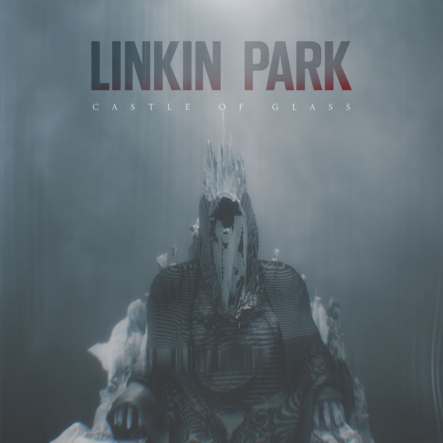
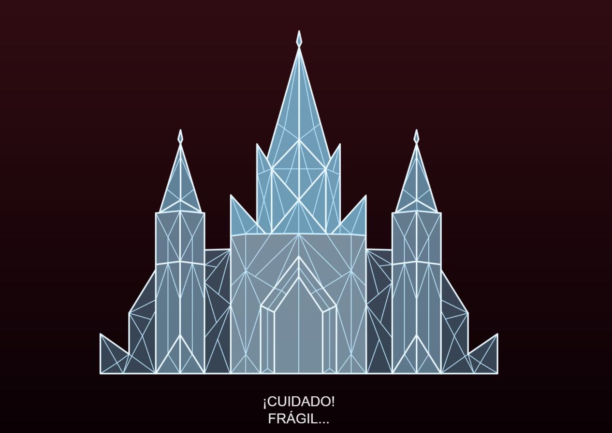
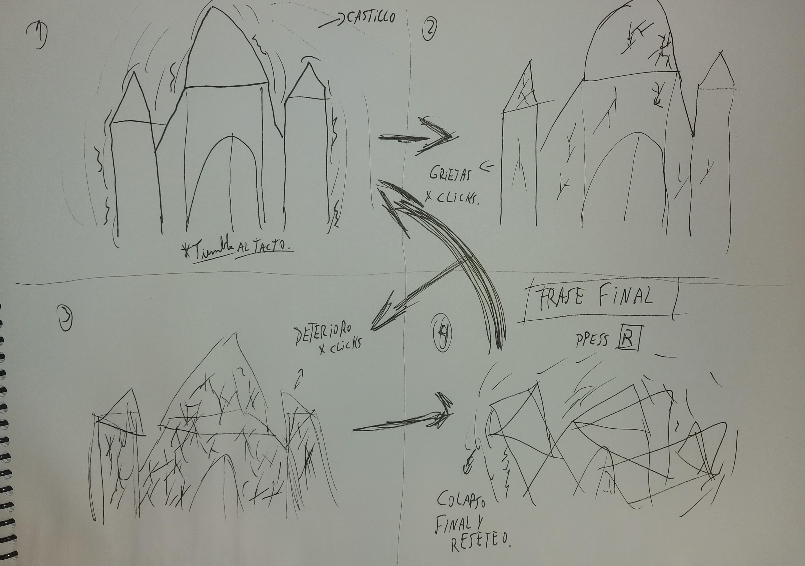

## Link de web pública (github pages)

https://spiderm8nkey.github.io/proyecto-pensamiento-computacional-s5/

### Crack of Glass

### Referencia de origen / bibliografía


Linkin Park. (2012). Castle of Glass (canción). En Living Things. Warner Bros. Records.

### Imagen de referencia de proyecto



### Integrantes

Franco Moya [spiderm8nkey](https://github.com/spiderm8nkey)

### Enlace de p5.js 

<https://editor.p5js.org/spiderm8nkey/sketches/jtG_plI3y>

### Relato inicial

Un castillo de cristal con un aviso de "¡cuidado! fragil" que es sensible al tacto.

### Storyboard



### Estados

Estado base: El castillo se sensible al mouse, tambien se altera el fondo al acercar el mouse al castillo.
Estado 1: Al hacer click sobre el caastillo se empieza a agrietar y el fondo reacciona a cada click.
Estado 2: El castiillo se deteriora a medida que se acumulan clicks y el fondo reacciona con colores mas intensos.
Estado 3 y final: El castillo colapsa porla acumulacion de clicks y se integra el scroll que termina de comprimirlo y aparece una frase junto con el "press R" que vuelve al estado 1. 

#### Estado 1

En el primer estado, con alicia frente al conejo

al hacer scroll, Alicia empieza a caer

```js
//alicia cae
function aliciaEstatica(){
  //tu alicia quieta acá
  if (scroll) {
    caer();
  }
}
```


#### Estado 2

Alicia cayendo

si pasan 5 segundos, alicia se detiene

```js
//alicia cae
function aliciaCayendo(){
  //tu alicia quieta acá
  frameCount blablabla
}
```
